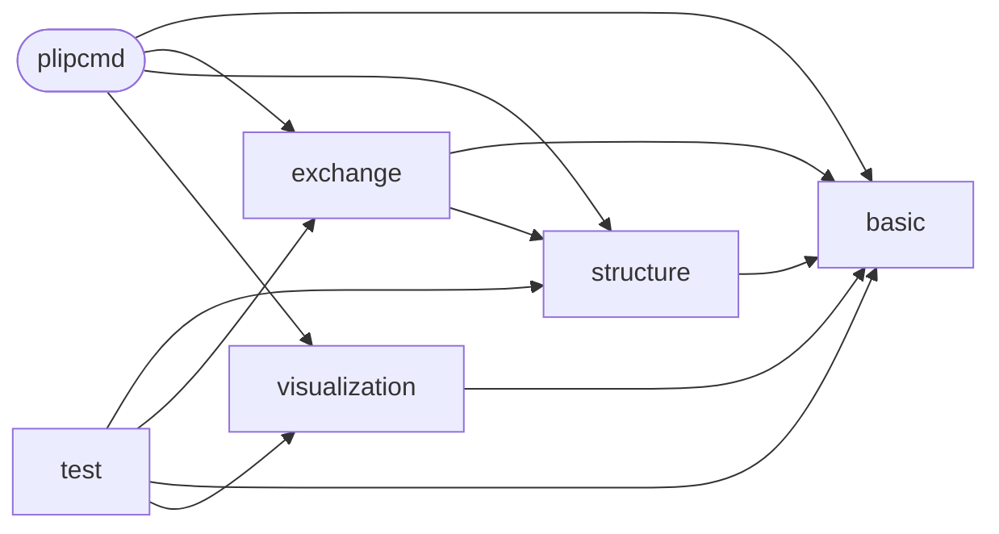

# Code Overview

[_Documentation generated by Documatic_](https://www.documatic.com)

<!---Documatic-section-Codebase Structure Python-start--->
## Codebase Structure Python

The codebase has a single-depth folder structure,
                with 34 code files in total.

<!---Documatic-block-system_architecture-start--->

<!---Documatic-block-system_architecture-end--->

# #
<!---Documatic-section-Codebase Structure Python-end--->

<!---Documatic-section-Important Functions-start--->
## Important Functions

<!---Documatic-block-important_funcs-start--->
<!---Documatic-block-most_used_funcs-start--->
### Most Utilised Functions

* [plip.basic.supplemental.euclidean3d](3-plip_basic.md#plip.basic.supplemental.euclidean3d) (3 times)
* [plip.basic.supplemental.vector](3-plip_basic.md#plip.basic.supplemental.vector) (3 times)
* plip.basic.config.__version__ (2 times)
* [plip.visualization.visualize.visualize_in_pymol](5-plip_visualization.md#plip.visualization.visualize.visualize_in_pymol) (2 times)
* [plip.basic.supplemental.vecangle](3-plip_basic.md#plip.basic.supplemental.vecangle) (2 times)
* [plip.basic.supplemental.projection](3-plip_basic.md#plip.basic.supplemental.projection) (2 times)
* [plip.basic.supplemental.normalize_vector](3-plip_basic.md#plip.basic.supplemental.normalize_vector) (2 times)
* [plip.basic.supplemental.cluster_doubles](3-plip_basic.md#plip.basic.supplemental.cluster_doubles) (2 times)
* [plip.basic.supplemental.centroid](3-plip_basic.md#plip.basic.supplemental.centroid) (2 times)
* [plip.basic.supplemental.whichchain](3-plip_basic.md#plip.basic.supplemental.whichchain) (2 times)
* [plip.basic.supplemental.whichrestype](3-plip_basic.md#plip.basic.supplemental.whichrestype) (2 times)
* [plip.basic.supplemental.whichresnumber](3-plip_basic.md#plip.basic.supplemental.whichresnumber) (2 times)
* [plip.basic.parallel.parallel_fn](3-plip_basic.md#plip.basic.parallel.parallel_fn) (1 times)
* [plip.exchange.webservices.fetch_pdb](4-plip_exchange.md#plip.exchange.webservices.fetch_pdb) (1 times)
* plip.structure.preparation.create_folder_if_not_exists (1 times)
* plip.structure.preparation.extract_pdbid (1 times)
* plip.structure.preparation.tilde_expansion (1 times)
* [plip.exchange.webservices.check_pdb_status](4-plip_exchange.md#plip.exchange.webservices.check_pdb_status) (1 times)
* [plip.basic.supplemental.start_pymol](3-plip_basic.md#plip.basic.supplemental.start_pymol) (1 times)
* [plip.basic.supplemental.tilde_expansion](3-plip_basic.md#plip.basic.supplemental.tilde_expansion) (1 times)
* [plip.basic.supplemental.tmpfile](3-plip_basic.md#plip.basic.supplemental.tmpfile) (1 times)
* [plip.basic.supplemental.classify_by_name](3-plip_basic.md#plip.basic.supplemental.classify_by_name) (1 times)
* [plip.basic.supplemental.is_lig](3-plip_basic.md#plip.basic.supplemental.is_lig) (1 times)
* [plip.basic.supplemental.ring_is_planar](3-plip_basic.md#plip.basic.supplemental.ring_is_planar) (1 times)
* [plip.basic.supplemental.extract_pdbid](3-plip_basic.md#plip.basic.supplemental.extract_pdbid) (1 times)
<!---Documatic-block-most_used_funcs-end--->
<!---Documatic-block-important_funcs-end--->

# #
<!---Documatic-section-Important Functions-end--->

<!---Documatic-section-File IO-start--->
## File IO

<!---Documatic-block-file_io-start--->
The following files have file read operations

<!---Documatic-block-plip.basic-start--->

	
<code>plip.basic</code> (Click to Expand!)

* plip.basic.supplemental

<!---Documatic-block-plip.basic-end--->

The following files have file write operations

<!---Documatic-block-plip.exchange-start--->

	
<code>plip.exchange</code> (Click to Expand!)

* plip.exchange.report

<!---Documatic-block-plip.exchange-end--->

<!---Documatic-block-plip.structure-start--->

	
<code>plip.structure</code> (Click to Expand!)

* plip.structure.preparation

<!---Documatic-block-plip.structure-end--->

<!---Documatic-block-plip.visualization-start--->

	
<code>plip.visualization</code> (Click to Expand!)

* plip.visualization.pymol: /dev/null

<!---Documatic-block-plip.visualization-end--->
<!---Documatic-block-file_io-end--->

# #
<!---Documatic-section-File IO-end--->

<!---Documatic-section-Class Hierarchy-start--->
## Class Hierarchy

<!---Documatic-block-Exception-start--->

	
<code>Exception</code> (Click to Expand!)

* plip.basic.parallel.SubProcessError

<!---Documatic-block-Exception-end--->

<!---Documatic-block-plip.exchange.xml.Interaction-start--->

	
<code>plip.exchange.xml.Interaction</code> (Click to Expand!)

* plip.exchange.xml.HalogenBond
* plip.exchange.xml.HydrogenBond
* plip.exchange.xml.HydrophobicInteraction
* plip.exchange.xml.MetalComplex
* plip.exchange.xml.PiCation
* plip.exchange.xml.PiStacking
* plip.exchange.xml.SaltBridge
* plip.exchange.xml.WaterBridge

<!---Documatic-block-plip.exchange.xml.Interaction-end--->

<!---Documatic-block-plip.exchange.xml.XMLStorage-start--->

	
<code>plip.exchange.xml.XMLStorage</code> (Click to Expand!)

* plip.exchange.xml.Interaction

<!---Documatic-block-plip.exchange.xml.XMLStorage-end--->

<!---Documatic-block-unittest.TestCase-start--->

	
<code>unittest.TestCase</code> (Click to Expand!)

* plip.test.test_pi_stacking.RingDetectionTest

<!---Documatic-block-unittest.TestCase-end--->

# #
<!---Documatic-section-Class Hierarchy-end--->

[_Documentation generated by Documatic_](https://www.documatic.com)