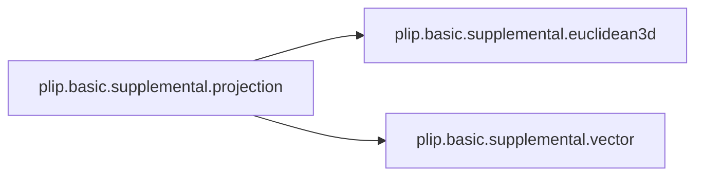
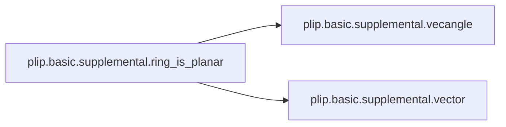

# Plip Basic

[_Documentation generated by Documatic_](https://www.documatic.com)

<!---Documatic-section-Codebase Structure-start--->
## Codebase Structure

<!---Documatic-block-system_architecture-start--->
```mermaid
None
```
<!---Documatic-block-system_architecture-end--->

# #
<!---Documatic-section-Codebase Structure-end--->

<!---Documatic-section-plip.basic.supplemental.euclidean3d-start--->
## [plip.basic.supplemental.euclidean3d](3-plip_basic.md#plip.basic.supplemental.euclidean3d)

<!---Documatic-section-euclidean3d-start--->
<!---Documatic-block-plip.basic.supplemental.euclidean3d-start--->
<details>
	<summary><code>plip.basic.supplemental.euclidean3d</code> code snippet</summary>

```python
def euclidean3d(v1, v2):
    if not len(v1) == 3 and len(v2) == 3:
        return None
    return np.sqrt((v1[0] - v2[0]) ** 2 + (v1[1] - v2[1]) ** 2 + (v1[2] - v2[2]) ** 2)
```
</details>
<!---Documatic-block-plip.basic.supplemental.euclidean3d-end--->
<!---Documatic-section-euclidean3d-end--->

# #
<!---Documatic-section-plip.basic.supplemental.euclidean3d-end--->

<!---Documatic-section-plip.basic.supplemental.vector-start--->
## [plip.basic.supplemental.vector](3-plip_basic.md#plip.basic.supplemental.vector)

<!---Documatic-section-vector-start--->
<!---Documatic-block-plip.basic.supplemental.vector-start--->
<details>
	<summary><code>plip.basic.supplemental.vector</code> code snippet</summary>

```python
def vector(p1, p2):
    return None if len(p1) != len(p2) else np.array([p2[i] - p1[i] for i in range(len(p1))])
```
</details>
<!---Documatic-block-plip.basic.supplemental.vector-end--->
<!---Documatic-section-vector-end--->

# #
<!---Documatic-section-plip.basic.supplemental.vector-end--->

<!---Documatic-section-plip.basic.supplemental.vecangle-start--->
## [plip.basic.supplemental.vecangle](3-plip_basic.md#plip.basic.supplemental.vecangle)

<!---Documatic-section-vecangle-start--->
<!---Documatic-block-plip.basic.supplemental.vecangle-start--->
<details>
	<summary><code>plip.basic.supplemental.vecangle</code> code snippet</summary>

```python
def vecangle(v1, v2, deg=True):
    if np.array_equal(v1, v2):
        return 0.0
    dm = np.dot(v1, v2)
    cm = np.linalg.norm(v1) * np.linalg.norm(v2)
    angle = np.arccos(dm / cm)
    return np.degrees([angle])[0] if deg else angle
```
</details>
<!---Documatic-block-plip.basic.supplemental.vecangle-end--->
<!---Documatic-section-vecangle-end--->

# #
<!---Documatic-section-plip.basic.supplemental.vecangle-end--->

<!---Documatic-section-plip.basic.supplemental.projection-start--->
## [plip.basic.supplemental.projection](3-plip_basic.md#plip.basic.supplemental.projection)

<!---Documatic-section-projection-start--->


### Object Calls

* [plip.basic.supplemental.euclidean3d](3-plip_basic.md#plip.basic.supplemental.euclidean3d)
* [plip.basic.supplemental.vector](3-plip_basic.md#plip.basic.supplemental.vector)

<!---Documatic-block-plip.basic.supplemental.projection-start--->
<details>
	<summary><code>plip.basic.supplemental.projection</code> code snippet</summary>

```python
def projection(pnormal1, ppoint, tpoint):
    pnormal2 = [coo * -1 for coo in pnormal1]
    d1 = euclidean3d(tpoint, pnormal1 + ppoint)
    d2 = euclidean3d(tpoint, pnormal2 + ppoint)
    pnormal = pnormal1 if d1 < d2 else pnormal2
    sn = -np.dot(pnormal, vector(ppoint, tpoint))
    sd = np.dot(pnormal, pnormal)
    sb = sn / sd
    return [c1 + c2 for (c1, c2) in zip(tpoint, [sb * pn for pn in pnormal])]
```
</details>
<!---Documatic-block-plip.basic.supplemental.projection-end--->
<!---Documatic-section-projection-end--->

# #
<!---Documatic-section-plip.basic.supplemental.projection-end--->

<!---Documatic-section-plip.basic.supplemental.normalize_vector-start--->
## [plip.basic.supplemental.normalize_vector](3-plip_basic.md#plip.basic.supplemental.normalize_vector)

<!---Documatic-section-normalize_vector-start--->
<!---Documatic-block-plip.basic.supplemental.normalize_vector-start--->
<details>
	<summary><code>plip.basic.supplemental.normalize_vector</code> code snippet</summary>

```python
def normalize_vector(v):
    norm = np.linalg.norm(v)
    return v / norm if not norm == 0 else v
```
</details>
<!---Documatic-block-plip.basic.supplemental.normalize_vector-end--->
<!---Documatic-section-normalize_vector-end--->

# #
<!---Documatic-section-plip.basic.supplemental.normalize_vector-end--->

<!---Documatic-section-plip.basic.supplemental.cluster_doubles-start--->
## [plip.basic.supplemental.cluster_doubles](3-plip_basic.md#plip.basic.supplemental.cluster_doubles)

<!---Documatic-section-cluster_doubles-start--->
<!---Documatic-block-plip.basic.supplemental.cluster_doubles-start--->
<details>
	<summary><code>plip.basic.supplemental.cluster_doubles</code> code snippet</summary>

```python
def cluster_doubles(double_list):
    location = {}
    clusters = []
    for t in double_list:
        (a, b) = (t[0], t[1])
        if a in location and b in location:
            if location[a] != location[b]:
                if location[a] < location[b]:
                    clusters[location[a]] = clusters[location[a]].union(clusters[location[b]])
                    clusters = clusters[:location[b]] + clusters[location[b] + 1:]
                else:
                    clusters[location[b]] = clusters[location[b]].union(clusters[location[a]])
                    clusters = clusters[:location[a]] + clusters[location[a] + 1:]
                location = {}
                for (i, cluster) in enumerate(clusters):
                    for c in cluster:
                        location[c] = i
        else:
            if a in location:
                clusters[location[a]].add(b)
                location[b] = location[a]
            if b in location:
                clusters[location[b]].add(a)
                location[a] = location[b]
            if not (b in location and a in location):
                clusters.append(set(t))
                location[a] = len(clusters) - 1
                location[b] = len(clusters) - 1
    return map(tuple, clusters)
```
</details>
<!---Documatic-block-plip.basic.supplemental.cluster_doubles-end--->
<!---Documatic-section-cluster_doubles-end--->

# #
<!---Documatic-section-plip.basic.supplemental.cluster_doubles-end--->

<!---Documatic-section-plip.basic.supplemental.centroid-start--->
## [plip.basic.supplemental.centroid](3-plip_basic.md#plip.basic.supplemental.centroid)

<!---Documatic-section-centroid-start--->
<!---Documatic-block-plip.basic.supplemental.centroid-start--->
<details>
	<summary><code>plip.basic.supplemental.centroid</code> code snippet</summary>

```python
def centroid(coo):
    return list(map(np.mean, ([c[0] for c in coo], [c[1] for c in coo], [c[2] for c in coo])))
```
</details>
<!---Documatic-block-plip.basic.supplemental.centroid-end--->
<!---Documatic-section-centroid-end--->

# #
<!---Documatic-section-plip.basic.supplemental.centroid-end--->

<!---Documatic-section-plip.basic.supplemental.whichchain-start--->
## [plip.basic.supplemental.whichchain](3-plip_basic.md#plip.basic.supplemental.whichchain)

<!---Documatic-section-whichchain-start--->
<!---Documatic-block-plip.basic.supplemental.whichchain-start--->
<details>
	<summary><code>plip.basic.supplemental.whichchain</code> code snippet</summary>

```python
def whichchain(atom):
    atom = atom if not isinstance(atom, Atom) else atom.OBAtom
    return atom.GetResidue().GetChain() if atom.GetResidue() is not None else None
```
</details>
<!---Documatic-block-plip.basic.supplemental.whichchain-end--->
<!---Documatic-section-whichchain-end--->

# #
<!---Documatic-section-plip.basic.supplemental.whichchain-end--->

<!---Documatic-section-plip.basic.supplemental.whichrestype-start--->
## [plip.basic.supplemental.whichrestype](3-plip_basic.md#plip.basic.supplemental.whichrestype)

<!---Documatic-section-whichrestype-start--->
<!---Documatic-block-plip.basic.supplemental.whichrestype-start--->
<details>
	<summary><code>plip.basic.supplemental.whichrestype</code> code snippet</summary>

```python
def whichrestype(atom):
    atom = atom if not isinstance(atom, Atom) else atom.OBAtom
    return atom.GetResidue().GetName() if atom.GetResidue() is not None else None
```
</details>
<!---Documatic-block-plip.basic.supplemental.whichrestype-end--->
<!---Documatic-section-whichrestype-end--->

# #
<!---Documatic-section-plip.basic.supplemental.whichrestype-end--->

<!---Documatic-section-plip.basic.supplemental.whichresnumber-start--->
## [plip.basic.supplemental.whichresnumber](3-plip_basic.md#plip.basic.supplemental.whichresnumber)

<!---Documatic-section-whichresnumber-start--->
<!---Documatic-block-plip.basic.supplemental.whichresnumber-start--->
<details>
	<summary><code>plip.basic.supplemental.whichresnumber</code> code snippet</summary>

```python
def whichresnumber(atom):
    atom = atom if not isinstance(atom, Atom) else atom.OBAtom
    return atom.GetResidue().GetNum() if atom.GetResidue() is not None else None
```
</details>
<!---Documatic-block-plip.basic.supplemental.whichresnumber-end--->
<!---Documatic-section-whichresnumber-end--->

# #
<!---Documatic-section-plip.basic.supplemental.whichresnumber-end--->

<!---Documatic-section-plip.basic.parallel.parallel_fn-start--->
## [plip.basic.parallel.parallel_fn](3-plip_basic.md#plip.basic.parallel.parallel_fn)

<!---Documatic-section-parallel_fn-start--->


### Object Calls

* [plip.basic.parallel.pool_args](3-plip_basic.md#plip.basic.parallel.pool_args)

<!---Documatic-block-plip.basic.parallel.parallel_fn-start--->
<details>
	<summary><code>plip.basic.parallel.parallel_fn</code> code snippet</summary>

```python
def parallel_fn(f):

    def simple_parallel(func, sequence, **args):
        """ f takes an element of sequence as input and the keyword args in **args"""
        if 'processes' in args:
            processes = args.get('processes')
            del args['processes']
        else:
            processes = multiprocessing.cpu_count()
        pool = multiprocessing.Pool(processes)
        result = pool.map_async(universal_worker, pool_args(func, sequence, args))
        pool.close()
        pool.join()
        cleaned = [x for x in result.get() if x is not None]
        cleaned = asarray(cleaned)
        return cleaned
    return partial(simple_parallel, f)
```
</details>
<!---Documatic-block-plip.basic.parallel.parallel_fn-end--->
<!---Documatic-section-parallel_fn-end--->

# #
<!---Documatic-section-plip.basic.parallel.parallel_fn-end--->

<!---Documatic-section-plip.basic.supplemental.start_pymol-start--->
## [plip.basic.supplemental.start_pymol](3-plip_basic.md#plip.basic.supplemental.start_pymol)

<!---Documatic-section-start_pymol-start--->


### Object Calls

* [plip.basic.supplemental.initialize_pymol](3-plip_basic.md#plip.basic.supplemental.initialize_pymol)

<!---Documatic-block-plip.basic.supplemental.start_pymol-start--->
<details>
	<summary><code>plip.basic.supplemental.start_pymol</code> code snippet</summary>

```python
def start_pymol(quiet=False, options='-p', run=False):
    import pymol
    pymol.pymol_argv = ['pymol', '%s' % options] + sys.argv[1:]
    if run:
        initialize_pymol(options)
    if quiet:
        pymol.cmd.feedback('disable', 'all', 'everything')
```
</details>
<!---Documatic-block-plip.basic.supplemental.start_pymol-end--->
<!---Documatic-section-start_pymol-end--->

# #
<!---Documatic-section-plip.basic.supplemental.start_pymol-end--->

<!---Documatic-section-plip.basic.supplemental.tilde_expansion-start--->
## [plip.basic.supplemental.tilde_expansion](3-plip_basic.md#plip.basic.supplemental.tilde_expansion)

<!---Documatic-section-tilde_expansion-start--->
<!---Documatic-block-plip.basic.supplemental.tilde_expansion-start--->
<details>
	<summary><code>plip.basic.supplemental.tilde_expansion</code> code snippet</summary>

```python
def tilde_expansion(folder_path):
    return os.path.expanduser(folder_path) if '~' in folder_path else folder_path
```
</details>
<!---Documatic-block-plip.basic.supplemental.tilde_expansion-end--->
<!---Documatic-section-tilde_expansion-end--->

# #
<!---Documatic-section-plip.basic.supplemental.tilde_expansion-end--->

<!---Documatic-section-plip.basic.supplemental.tmpfile-start--->
## [plip.basic.supplemental.tmpfile](3-plip_basic.md#plip.basic.supplemental.tmpfile)

<!---Documatic-section-tmpfile-start--->
<!---Documatic-block-plip.basic.supplemental.tmpfile-start--->
<details>
	<summary><code>plip.basic.supplemental.tmpfile</code> code snippet</summary>

```python
def tmpfile(prefix, direc):
    return tempfile.mktemp(prefix=prefix, suffix='.pdb', dir=direc)
```
</details>
<!---Documatic-block-plip.basic.supplemental.tmpfile-end--->
<!---Documatic-section-tmpfile-end--->

# #
<!---Documatic-section-plip.basic.supplemental.tmpfile-end--->

<!---Documatic-section-plip.basic.supplemental.classify_by_name-start--->
## [plip.basic.supplemental.classify_by_name](3-plip_basic.md#plip.basic.supplemental.classify_by_name)

<!---Documatic-section-classify_by_name-start--->
<!---Documatic-block-plip.basic.supplemental.classify_by_name-start--->
<details>
	<summary><code>plip.basic.supplemental.classify_by_name</code> code snippet</summary>

```python
def classify_by_name(names):
    if len(names) > 3:
        if len(set(config.RNA).intersection(set(names))) != 0:
            ligtype = 'RNA'
        elif len(set(config.DNA).intersection(set(names))) != 0:
            ligtype = 'DNA'
        else:
            ligtype = 'POLYMER'
    else:
        ligtype = 'SMALLMOLECULE'
    for name in names:
        if name in config.METAL_IONS:
            if len(names) == 1:
                ligtype = 'ION'
            elif 'ION' not in ligtype:
                ligtype += '+ION'
    return ligtype
```
</details>
<!---Documatic-block-plip.basic.supplemental.classify_by_name-end--->
<!---Documatic-section-classify_by_name-end--->

# #
<!---Documatic-section-plip.basic.supplemental.classify_by_name-end--->

<!---Documatic-section-plip.basic.supplemental.is_lig-start--->
## [plip.basic.supplemental.is_lig](3-plip_basic.md#plip.basic.supplemental.is_lig)

<!---Documatic-section-is_lig-start--->
<!---Documatic-block-plip.basic.supplemental.is_lig-start--->
<details>
	<summary><code>plip.basic.supplemental.is_lig</code> code snippet</summary>

```python
def is_lig(hetid):
    h = hetid.upper()
    return not (h == 'HOH' or h in config.UNSUPPORTED)
```
</details>
<!---Documatic-block-plip.basic.supplemental.is_lig-end--->
<!---Documatic-section-is_lig-end--->

# #
<!---Documatic-section-plip.basic.supplemental.is_lig-end--->

<!---Documatic-section-plip.basic.supplemental.ring_is_planar-start--->
## [plip.basic.supplemental.ring_is_planar](3-plip_basic.md#plip.basic.supplemental.ring_is_planar)

<!---Documatic-section-ring_is_planar-start--->


### Object Calls

* [plip.basic.supplemental.vecangle](3-plip_basic.md#plip.basic.supplemental.vecangle)
* [plip.basic.supplemental.vector](3-plip_basic.md#plip.basic.supplemental.vector)

<!---Documatic-block-plip.basic.supplemental.ring_is_planar-start--->
<details>
	<summary><code>plip.basic.supplemental.ring_is_planar</code> code snippet</summary>

```python
def ring_is_planar(ring, r_atoms):
    normals = []
    for a in r_atoms:
        adj = pybel.ob.OBAtomAtomIter(a.OBAtom)
        n_coords = [pybel.Atom(neigh).coords for neigh in adj if ring.IsMember(neigh)]
        (vec1, vec2) = (vector(a.coords, n_coords[0]), vector(a.coords, n_coords[1]))
        normals.append(np.cross(vec1, vec2))
    for (n1, n2) in itertools.product(normals, repeat=2):
        arom_angle = vecangle(n1, n2)
        if all([arom_angle > config.AROMATIC_PLANARITY, arom_angle < 180.0 - config.AROMATIC_PLANARITY]):
            return False
    return True
```
</details>
<!---Documatic-block-plip.basic.supplemental.ring_is_planar-end--->
<!---Documatic-section-ring_is_planar-end--->

# #
<!---Documatic-section-plip.basic.supplemental.ring_is_planar-end--->

<!---Documatic-section-plip.basic.supplemental.extract_pdbid-start--->
## [plip.basic.supplemental.extract_pdbid](3-plip_basic.md#plip.basic.supplemental.extract_pdbid)

<!---Documatic-section-extract_pdbid-start--->
<!---Documatic-block-plip.basic.supplemental.extract_pdbid-start--->
<details>
	<summary><code>plip.basic.supplemental.extract_pdbid</code> code snippet</summary>

```python
def extract_pdbid(string):
    p = re.compile('[0-9][0-9a-z]{3}')
    m = p.search(string.lower())
    try:
        return m.group()
    except AttributeError:
        return 'UnknownProtein'
```
</details>
<!---Documatic-block-plip.basic.supplemental.extract_pdbid-end--->
<!---Documatic-section-extract_pdbid-end--->

# #
<!---Documatic-section-plip.basic.supplemental.extract_pdbid-end--->

<!---Documatic-section-plip.basic.supplemental.initialize_pymol-start--->
## [plip.basic.supplemental.initialize_pymol](3-plip_basic.md#plip.basic.supplemental.initialize_pymol)

<!---Documatic-section-initialize_pymol-start--->
<!---Documatic-block-plip.basic.supplemental.initialize_pymol-start--->
<details>
	<summary><code>plip.basic.supplemental.initialize_pymol</code> code snippet</summary>

```python
def initialize_pymol(options):
    import pymol
    pymol.finish_launching(args=['pymol', options, '-K'])
    pymol.cmd.reinitialize()
```
</details>
<!---Documatic-block-plip.basic.supplemental.initialize_pymol-end--->
<!---Documatic-section-initialize_pymol-end--->

# #
<!---Documatic-section-plip.basic.supplemental.initialize_pymol-end--->

<!---Documatic-section-plip.basic.parallel.pool_args-start--->
## [plip.basic.parallel.pool_args](3-plip_basic.md#plip.basic.parallel.pool_args)

<!---Documatic-section-pool_args-start--->
<!---Documatic-block-plip.basic.parallel.pool_args-start--->
<details>
	<summary><code>plip.basic.parallel.pool_args</code> code snippet</summary>

```python
def pool_args(function, sequence, kwargs):
    return zip(itertools.repeat(function), sequence, itertools.repeat(kwargs))
```
</details>
<!---Documatic-block-plip.basic.parallel.pool_args-end--->
<!---Documatic-section-pool_args-end--->

# #
<!---Documatic-section-plip.basic.parallel.pool_args-end--->

[_Documentation generated by Documatic_](https://www.documatic.com)