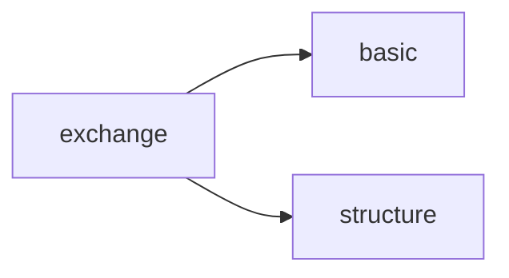

# Plip Exchange

[_Documentation generated by Documatic_](https://www.documatic.com)

<!---Documatic-section-Codebase Structure-start--->
## Codebase Structure

<!---Documatic-block-system_architecture-start--->

<!---Documatic-block-system_architecture-end--->

# #
<!---Documatic-section-Codebase Structure-end--->

<!---Documatic-section-plip.exchange.webservices.fetch_pdb-start--->
## [plip.exchange.webservices.fetch_pdb](4-plip_exchange.md#plip.exchange.webservices.fetch_pdb)

<!---Documatic-section-fetch_pdb-start--->
<!---Documatic-block-plip.exchange.webservices.fetch_pdb-start--->
<details>
	<summary><code>plip.exchange.webservices.fetch_pdb</code> code snippet</summary>

```python
def fetch_pdb(pdbid):
    pdbid = pdbid.lower()
    logger.info('downloading file from PDB')
    pdburl = f'https://files.rcsb.org/download/{pdbid}.pdb'
    try:
        pdbfile = urlopen(pdburl).read().decode()
        if 'sorry' in pdbfile:
            logger.error('no file in PDB format available from wwPDB for the given PDB ID.')
            sys.exit(1)
    except HTTPError:
        logger.error('no file in PDB format available from wwPDB for the given PDB ID')
        sys.exit(1)
    return [pdbfile, pdbid]
```
</details>
<!---Documatic-block-plip.exchange.webservices.fetch_pdb-end--->
<!---Documatic-section-fetch_pdb-end--->

# #
<!---Documatic-section-plip.exchange.webservices.fetch_pdb-end--->

<!---Documatic-section-plip.exchange.webservices.check_pdb_status-start--->
## [plip.exchange.webservices.check_pdb_status](4-plip_exchange.md#plip.exchange.webservices.check_pdb_status)

<!---Documatic-section-check_pdb_status-start--->
<!---Documatic-block-plip.exchange.webservices.check_pdb_status-start--->
<details>
	<summary><code>plip.exchange.webservices.check_pdb_status</code> code snippet</summary>

```python
def check_pdb_status(pdbid):
    url = 'http://www.rcsb.org/pdb/rest/idStatus?structureId=%s' % pdbid
    xmlf = urlopen(url)
    xml = et.parse(xmlf)
    xmlf.close()
    status = None
    current_pdbid = pdbid
    for df in xml.xpath('//record'):
        status = df.attrib['status']
        if status == 'OBSOLETE':
            current_pdbid = df.attrib['replacedBy']
    return [status, current_pdbid.lower()]
```
</details>
<!---Documatic-block-plip.exchange.webservices.check_pdb_status-end--->
<!---Documatic-section-check_pdb_status-end--->

# #
<!---Documatic-section-plip.exchange.webservices.check_pdb_status-end--->

[_Documentation generated by Documatic_](https://www.documatic.com)