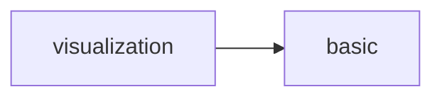
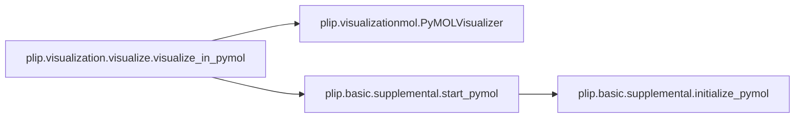

# Plip Visualization

[_Documentation generated by Documatic_](https://www.documatic.com)

<!---Documatic-section-Codebase Structure-start--->
## Codebase Structure

<!---Documatic-block-system_architecture-start--->

<!---Documatic-block-system_architecture-end--->

# #
<!---Documatic-section-Codebase Structure-end--->

<!---Documatic-section-plip.visualization.visualize.visualize_in_pymol-start--->
## [plip.visualization.visualize.visualize_in_pymol](5-plip_visualization.md#plip.visualization.visualize.visualize_in_pymol)

<!---Documatic-section-visualize_in_pymol-start--->


### Object Calls

* plip.visualizationmol.PyMOLVisualizer
* [plip.basic.supplemental.start_pymol](3-plip_basic.md#plip.basic.supplemental.start_pymol)

<!---Documatic-block-plip.visualization.visualize.visualize_in_pymol-start--->
<details>
	<summary><code>plip.visualization.visualize.visualize_in_pymol</code> code snippet</summary>

```python
def visualize_in_pymol(plcomplex):
    vis = PyMOLVisualizer(plcomplex)
    pdbid = plcomplex.pdbid
    lig_members = plcomplex.lig_members
    chain = plcomplex.chain
    if config.PEPTIDES:
        vis.ligname = 'PeptideChain%s' % plcomplex.chain
    if config.INTRA is not None:
        vis.ligname = 'Intra%s' % plcomplex.chain
    ligname = vis.ligname
    hetid = plcomplex.hetid
    metal_ids = plcomplex.metal_ids
    metal_ids_str = '+'.join([str(i) for i in metal_ids])
    start_pymol(run=True, options='-pcq', quiet=not config.VERBOSE and (not config.SILENT))
    vis.set_initial_representations()
    cmd.load(plcomplex.sourcefile)
    cmd.frame(config.MODEL)
    current_name = cmd.get_object_list(selection='(all)')[0]
    logger.debug(f'setting current_name to {current_name} and PDB-ID to {pdbid}')
    cmd.set_name(current_name, pdbid)
    cmd.hide('everything', 'all')
    if config.PEPTIDES:
        cmd.select(ligname, 'chain %s and not resn HOH' % plcomplex.chain)
    else:
        cmd.select(ligname, 'resn %s and chain %s and resi %s*' % (hetid, chain, plcomplex.position))
    logger.debug(f'selecting ligand for PDBID {pdbid} and ligand name {ligname}')
    logger.debug(f'resn {hetid} and chain {chain} and resi {plcomplex.position}')
    if not len(metal_ids) == 0:
        vis.select_by_ids(ligname, metal_ids, selection_exists=True)
        cmd.show('spheres', 'id %s and %s' % (metal_ids_str, pdbid))
    if len(lig_members) > 1:
        for member in lig_members:
            (resid, chain, resnr) = (member[0], member[1], str(member[2]))
            cmd.select(ligname, '%s or (resn %s and chain %s and resi %s)' % (ligname, resid, chain, resnr))
    cmd.show('sticks', ligname)
    cmd.color('myblue')
    cmd.color('myorange', ligname)
    cmd.util.cnc('all')
    if not len(metal_ids) == 0:
        cmd.color('hotpink', 'id %s' % metal_ids_str)
        cmd.hide('sticks', 'id %s' % metal_ids_str)
        cmd.set('sphere_scale', 0.3, ligname)
    cmd.deselect()
    vis.make_initial_selections()
    vis.show_hydrophobic()
    vis.show_hbonds()
    vis.show_halogen()
    vis.show_stacking()
    vis.show_cationpi()
    vis.show_sbridges()
    vis.show_wbridges()
    vis.show_metal()
    vis.refinements()
    vis.zoom_to_ligand()
    vis.selections_cleanup()
    vis.selections_group()
    vis.additional_cleanup()
    if config.DNARECEPTOR:
        cmd.set_name('%sCartoon' % plcomplex.pdbid, '%sLines' % plcomplex.pdbid)
        cmd.hide('cartoon', '%sLines' % plcomplex.pdbid)
        cmd.show('lines', '%sLines' % plcomplex.pdbid)
    if config.PEPTIDES:
        filename = '%s_PeptideChain%s' % (pdbid.upper(), plcomplex.chain)
        if config.PYMOL:
            vis.save_session(config.OUTPATH, override=filename)
    elif config.INTRA is not None:
        filename = '%s_IntraChain%s' % (pdbid.upper(), plcomplex.chain)
        if config.PYMOL:
            vis.save_session(config.OUTPATH, override=filename)
    else:
        filename = '%s_%s' % (pdbid.upper(), '_'.join([hetid, plcomplex.chain, plcomplex.position]))
        if config.PYMOL:
            vis.save_session(config.OUTPATH)
    if config.PICS:
        vis.save_picture(config.OUTPATH, filename)
```
</details>
<!---Documatic-block-plip.visualization.visualize.visualize_in_pymol-end--->
<!---Documatic-section-visualize_in_pymol-end--->

# #
<!---Documatic-section-plip.visualization.visualize.visualize_in_pymol-end--->

[_Documentation generated by Documatic_](https://www.documatic.com)